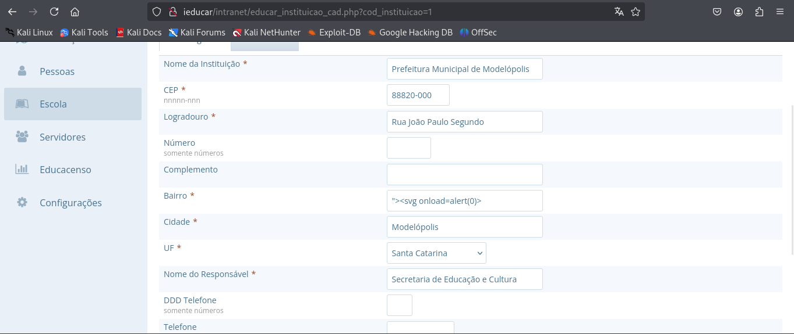

### Summary
The application fails to properly validate and sanatize user supplied input, hence leading to a stored cross-site scripting vulnerability that resides within the neighborhood input field (campo para inserção do bairro) on `/intranet/educar_instituicao_cad.php `

### Details
While editing the neighborhood input field, which can be accessed at _Cadastro> Instiuição> Editar_, it's possible to insert arbitrary javascript code which is then stored and executed once the user gets back to the previous page.

### PoC
Firstly, the neighborhood field was changed and the payload `"><svg onload=alert(1)>` was inserted. 

Secondly, once the user get back to the previous page the payload was triggered.

Affected endpoint =>`/educar_instituicao_cad.php`
Affected parameter => _neighborhood name_

### Impact

- Stealing session cookies: Attackers can use stolen session cookies to hijack a user's session and perform actions on their behalf.
- Downloading malware: Attackers can trick users into downloading and installing malware on their computers.
- Hijacking browsers: Attackers can hijack a user's browser or deliver browser-based exploits.
- Stealing credentials: Attackers can steal a user's credentials.
- Obtaining sensitive information: Attackers can obtain sensitive information stored in a user's account or in their browser.
- Defacing websites: Attackers can deface a website by altering its content.
- Misdirecting users: Attackers can change the instructions given to users who visit the target website, misdirecting their behavior.
- Damaging a business's reputation: Attackers can damage a business's image or spread misinformation by defacing a corporate website.

### Discoverer

([Fernanda Martins](https://github.com/FeMarb/)) (founder)
([Natan Morette](https://br.linkedin.com/in/nmmorette/pt)) (coordinator)

by [CVE-Hunters](https://github.com/Sec-Dojo-Cyber-House/cve-hunters) 
